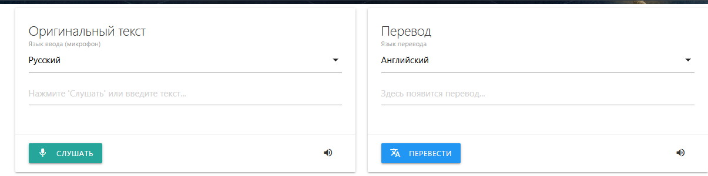
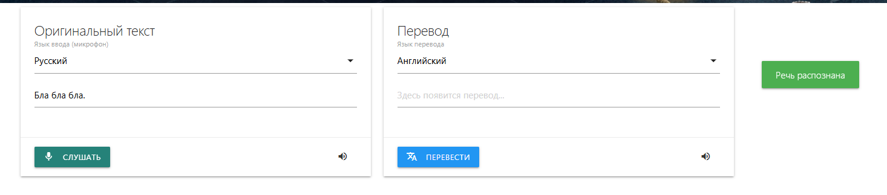
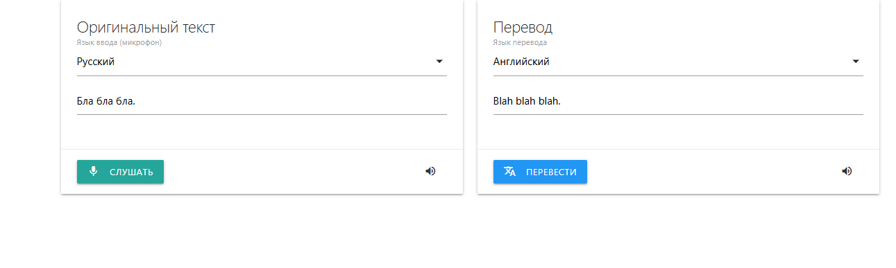

# lesson 10 homework

Використовуючи когнітивні сервіси для роботи з текстом, створіть свій перекладач.
Користувач може вводити текст з клавіатури або з мікрофона. Отримувати переклад бажаною мовою. Є можливість отримати озвучку свого тексту та перекладеного.
Ви можете створити консольний варіант або сайт.

